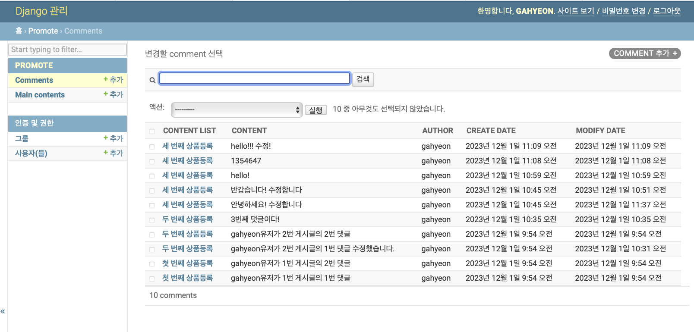
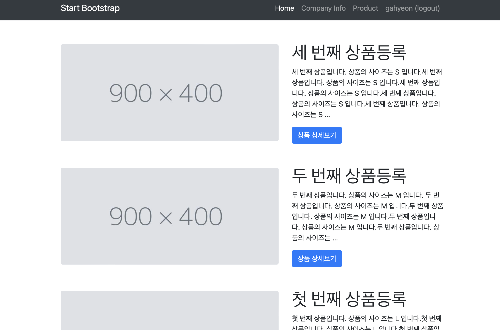
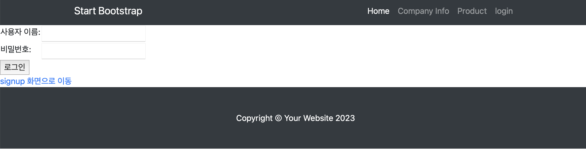
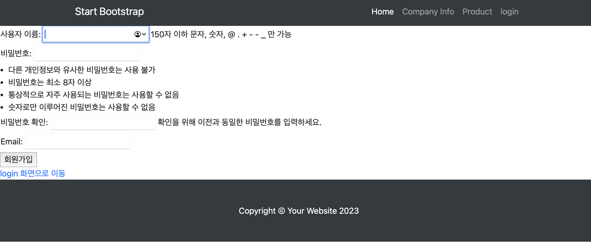
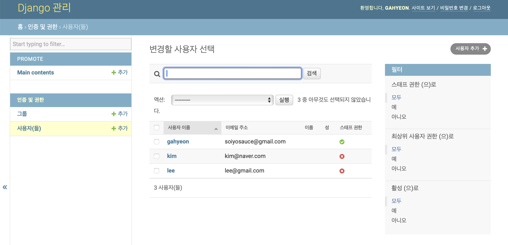

## A회사의 신규 상품 홍보 및 회사 소개 페이지 제작 프로젝트

#### [ 4주차 업데이트 내역 23/12/01 ]

### 발생 이슈
promote/models.py 에서 Comments 클래스 내 두 개의 DateTimeField에 입력되는 내용(comment.create_date, comment.modify_date)을 templates/promote/content_detail.html 의 22~26번째 줄에서 출력할 경우  
microsecond차이로 comment.create_date 와 comment.modify_date 결과값이 항상 달라 댓글을 수정하지 않아도 수정한 것으로 인식되었다.  
microsecond를 DateTimeField 필드에 들어가지 않게 하는 방법이나 이를 해결할 또다른 방법이 있을까? (미해결) 
현재 코드에서는 초(second)만 다르면 수정 버튼이 뜨는 것으로 임시방편을 해 두었다.

* 그 외 발생했던 이슈
1. pdf에서 붙여넣기로 작성된 코드는 겉으로 같아보여도 모종의 이유로 작동하지 않을 위험성이 있다. (해결)
2. admin 페이지 렌더링 시 'admin.site.register(Comment, CommentAdmin)' 형식으로 작성해주어야 동작한다. (해결)

---

### 업데이트 내역
1. /promote/int:content_id 
 
상품 정보 페이지 - 댓글 게시, 수정, 삭제 기능 추가

* #### submit 버튼 클릭 시
    1. 로그인 안되어있으면 로그인 페이지로 이동
    2. 로그인 되어있고, 내용 작성되어있을 시 게시
    3. 로그인 되어있고, 내용 작성안되어있을 시 상세페이지 다시 렌더링

2. /promote/comment/update/int:content_id 
 update시 뜨는 화면 추가

* #### 수정 버튼 클릭시
    1. 수정 화면 렌더링 후 수정할 내용 작성하고 submit 버튼 클릭시 상세페이지로 리다이렉트

* #### 삭제 버튼 클릭시
    1. 삭제 후  상세페이지 다시 렌더링

3. /admin 개선
 
Comments

Main contents

---

#### [ 3주차 업데이트 내역 23/11/26 ]

* 웹사이트의 공통 부분인 header와 footer를 템플릿화 : navbar, footer, base HTML 템플릿 분리 (템플릿 관리 용이하도록)
* 회원가입 기능과 로그인/로그아웃 기능 추가 :  acounts app에 login, signup 페이지 추가
* 상품 상세보기 페이지 구현

### 업데이트 내역
/    메인 페이지

/company   회사 소개 페이지

/promote  상품 정보 페이지

/promote/int:content_id  상품 상세정보 페이지

/login  로그인 페이지

/signup  회원가입 페이지

/admin  관리자 페이지

#### [ 2주차 업데이트 내역 23/11/20 ]
* 기본 틀 제작

/  메인 페이지

